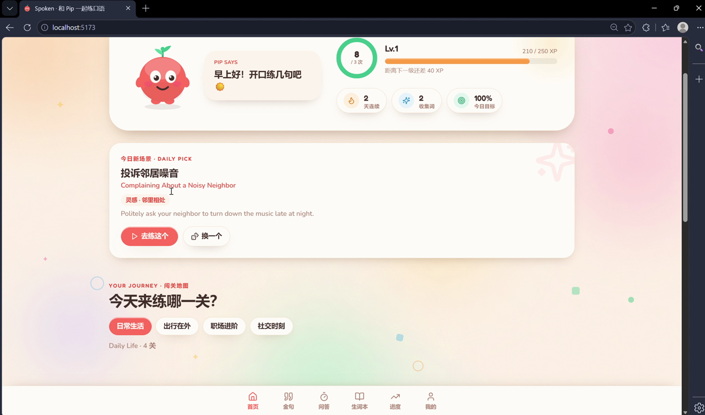
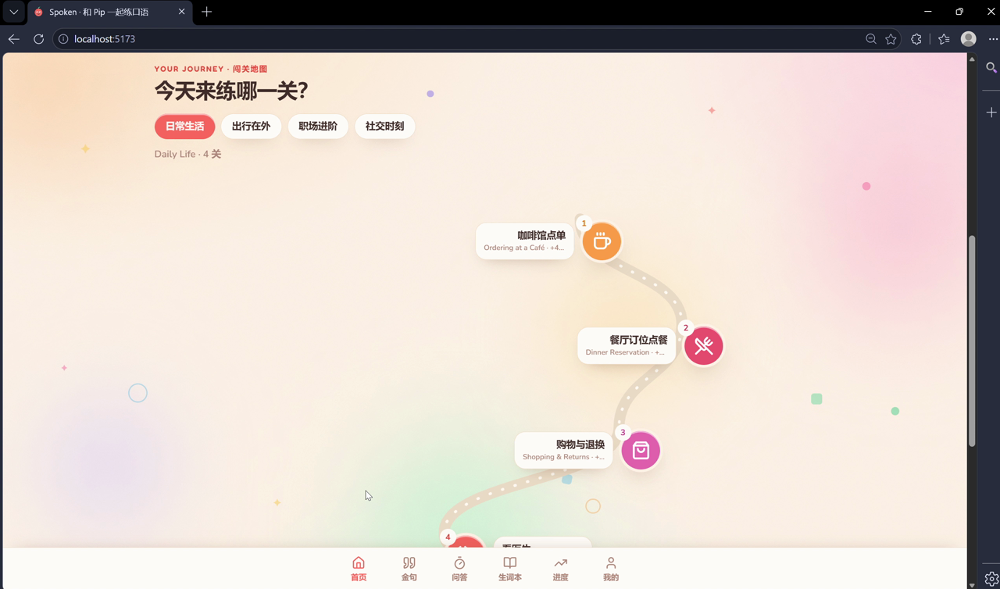
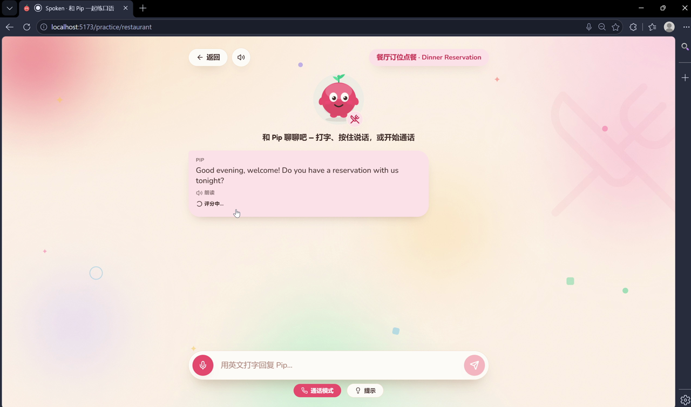
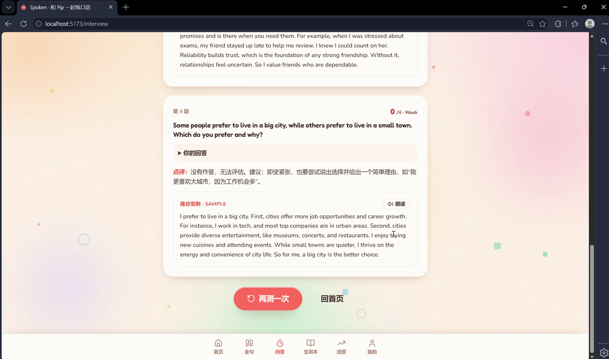
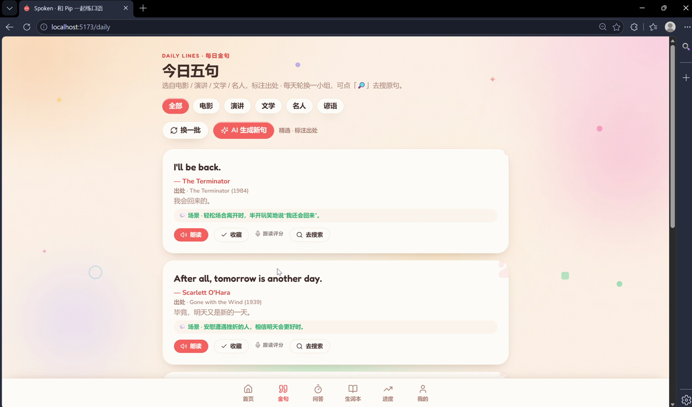
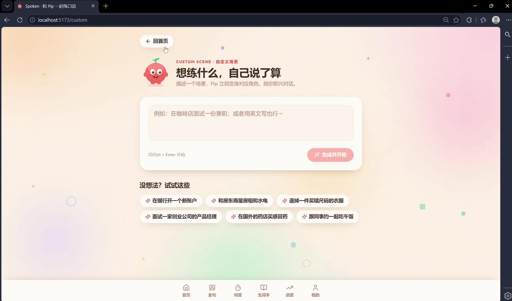
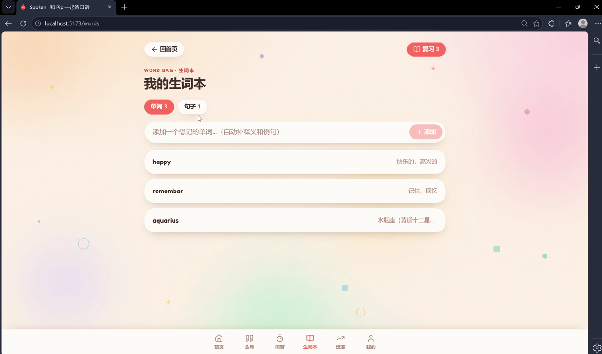
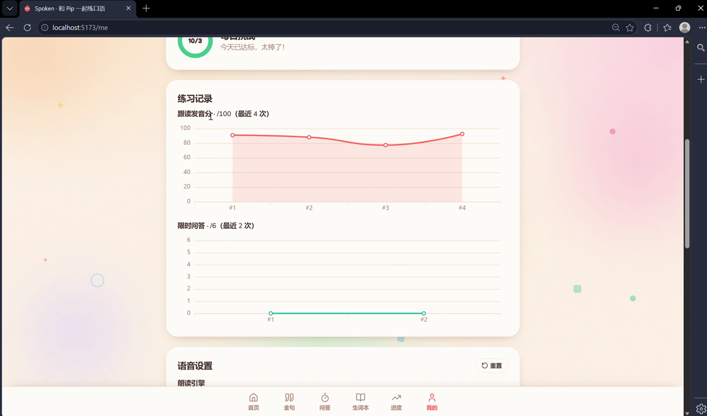

<div align="center">

# 🗣️ Spoken — AI 英语口语陪练

**在真实场景下用语音和 AI 对话练口语，并获得发音、语法与表达的量化反馈。**

[](https://github.com/EthanLyu30/spoken/actions/workflows/ci.yml)
[]()
[]()
[]()
[]()
[]()

🔗 **在线体验 / Live demo**：<https://spokenai.org> · 备用 <https://spoken-gamma.vercel.app>（国内访问可能稍慢）

中文 · [English](README.en.md)

</div>

> 参赛作品，按 [开发路线图](docs/ROADMAP.md) 分 PR 持续交付；README 随功能同步更新。

---

## 📖 项目简介

Spoken 是面向中文母语者的 **AI 英语口语陪练**。挑一个真实场景（求职面试、咖啡馆点单、看医生…），就能和 AI 伙伴 **Pip** 进行**语音 / 文字对话**；过程中和结束后，系统从**发音、语法、表达**三个维度给出量化评测与纠错，并把每次练习沉淀为**成长曲线**。

四个口语训练核心诉求贯穿设计：

- **对话自然度** —— Pip 稳定扮演角色，会追问、会引导，回复**逐字流式**返回。
- **语音流畅与低延迟** —— 朗读默认用浏览器原生语音（连贯自然、几乎即时），讯飞云端可选；对话回复流式输出；通话模式 ASR 实时流式（边说边出字幕，说完即接话），且支持**插话打断**——开口即停 Pip、立刻接管话轮。
- **纠错精准与时机** —— 发音 / 语法走"慢路"异步分析，不打断对话，回合结束即时反馈。
- **可量化的成长** —— 跟读分、对话分、限时问答成绩全部入库，生成趋势与课后报告。

---

## ⭐ 亮点

- **快慢双路架构** + **流式对话回复**：对话即时跟手，评测异步不阻塞。
- **全讯飞语音链路**：语音听写（ASR）+ 语音评测（ISE 发音打分）+ 在线合成（TTS）；朗读支持「浏览器原生 / 讯飞云端」双引擎与语速/音调/音色自定义。
- **托福级限时问答**：真实托福独立题题库 + AI 场景题，45 秒作答，按 ETS 标准打分并给高分范例。
- **会用而非死背的金句**：电影 / 演讲·TED / 文学 / 名人 / 谚语，**标注真实出处**（经 Wikiquote 核实、剔除误传名言）+ **应用场景** + 一键去搜原声。
- **自定义 & 每日生成场景**：一句话生成任意角色扮演；每天推荐一个新场景。
- **真实成长数据**：连续天数 / 等级 / XP / 今日目标 + 跟读与问答历史曲线 + **跨会话成长洞察**（指出最该练的维度、每个维度在进步还是回落），全部由真实活动驱动。
- **顺手不卡顿**：生词本本地缓存 + 乐观更新——切页秒开、收藏 / 加词即时生效，弱网下后台同步、失败自动回滚。
- **健壮**：请求超时兜底、流式失败自动回退、通话断流自动重连；60+ 后端测试。

---

## ✨ 核心功能

| 模块 | 说明 |
|---|---|
| 🗺️ 闯关地图首页 | 14 个场景分 4 章（生活 / 出行 / 职场 / 社交）的蜿蜒地图；首页成长数据为真实统计 |
| 💬 场景对话 | 与 Pip 角色扮演，回复**逐字流式**显示（失败自动回退） |
| 🧩 自定义场景 | 一句话描述任意场景 → DeepSeek 即时生成人设并角色扮演 |
| ✨ 今日新场景 | 每日 DeepSeek 推荐一个新鲜场景，点开即玩（带「灵感」主题标签，每日缓存） |
| 🎙️ 实时语音对话 | 通话模式（能量 VAD 自动断句 + 实时字幕 + **插话打断** + 断流重连）/ 按住说话（识别后自动发送，无需再点发送）：讯飞 ASR → DeepSeek → 朗读 |
| 🔊 朗读引擎 | 默认浏览器原生语音（连贯自然）/ 可切讯飞云端；语速 · 音调 · 音色可调，可试听 |
| 📊 发音评测 | 讯飞 ISE「跟读评分」词级打分（准确 / 流利 / 完整），逐词上色，可展开看**逐音素**对错 |
| ⏱️ 限时问答 | 仿托福独立口语：真实题库 + AI 场景题，4 题 × 45 秒，ETS 标准打分（/6）+ 高分范例 |
| ✍️ 语法 / 表达纠错 | 课后小结结构化标注错误、给出修正与解释 |
| 📈 能力趋势 & 成长洞察 | 会话趋势（ECharts 雷达 + 曲线）+ **跨会话成长洞察**（最该练的维度 + 每维度进步/回落趋势）+ 跟读 / 限时问答历史曲线 |
| 📝 课后总结 | 对话结束生成综合报告（评分 / 纠错 / 好用表达 / 建议） |
| 💡 卡壳提示 | 一键让 Pip 给 2-3 句可参考的回答 |
| 📚 生词本 | 单词 / 句子分栏、详情展开、**间隔重复（SRS）复习**、手动加词、阅读时**划词收藏**、一键收藏可取消 |
| 📖 每日金句 | 分类（电影/演讲/文学/名人/谚语）+ 真实出处 + **应用场景** + 去搜索；可 AI 生成新句 |
| 🏅 成长体系 | 真实统计的等级 / XP / 连续天数 / 今日目标 + 成就徽章 |

---

## 🖼️ 截图

| 首页 · 成长数据 | 蜿蜒闯关地图 |
|---|---|
|  |  |
| **实时场景对话（流式回复）** | **限时问答 · 评分 + 高分范例** |
|  |  |
| **每日金句 · 真实出处 + 应用场景** | **自定义场景** |
|  |  |
| **生词本** | **我的 · 练习记录成长曲线** |
|  |  |

---

## 🏗️ 技术架构

采用**级联管线（Cascaded Pipeline）**而非纯端到端语音模型，因为发音评测与语法纠错都依赖中间结构化数据（转写文本、音素级打分）。核心是**快慢双路解耦**：

```
              ┌──────────── 快路（低延迟，保证对话流畅） ───────────┐
 🎤 麦克风 ─VAD断句─► ASR 实时转写 ──► 对话 LLM(流式) ──► 朗读(浏览器/讯飞) ─► 🔊
                      │
                      └─► 转写文本 ─┐
                                    ├─► 慢路（异步，不阻塞对话）
 对话结束 ───────────────────────────┴─► 发音评测 + 语法纠错 + 课后总结 ─► 📊
```

> 当前实现：对话回复已**流式**；通话模式下**朗读逐句流式**（首句一生成就开始播放，其余边生成边合成，明显缩短跟手延迟），且 **ASR 实时流式**（边说边出字幕、动态修正，说完即用最终结果接话；连不上中继时自动回退缓冲转写）；朗读默认浏览器原生语音、可切讯飞。完整设计见 **[docs/ARCHITECTURE.md](docs/ARCHITECTURE.md)**。

### 技术栈

| 层 | 选型 |
|---|---|
| 前端 | React 18 · TypeScript · Vite · Tailwind CSS · Zustand（持久化状态）· ECharts · 自研「Pip」设计系统（Fredoka / Nunito） |
| 后端 | Python 3.11 · FastAPI · WebSocket · SQLAlchemy · SQLite / Postgres |
| 语音识别 / 发音评测 | 科大讯飞（语音听写 IAT + 语音评测 ISE） |
| 语音合成 | 浏览器 Web Speech API（默认）/ 科大讯飞在线合成（可选） |
| 对话 / 纠错 / 总结 / 出题 | DeepSeek（`deepseek-chat`，对话走流式） |
| 语音活动检测 | 浏览器端能量 VAD（通话模式自动断句 + 断流重连） |
| 部署 | Docker Compose · Render（后端）· Vercel（前端）· Neon/Supabase（Postgres 持久化） |

---

## 🚀 快速开始

需要 **Python 3.11+** 与 **Node.js 18+**。

```bash
# 后端（默认 http://127.0.0.1:8000）
cd backend
python -m venv .venv && .venv\Scripts\activate    # Windows；macOS/Linux: source .venv/bin/activate
pip install -r requirements.txt
copy .env.example .env                              # 填入 DEEPSEEK_API_KEY（对话必需）、XF_*（语音）
uvicorn app.main:app --reload

# 前端（默认 http://localhost:5173），另开一个终端
cd frontend
npm install
npm run dev
```

打开 <http://localhost:5173> 即可使用。**仅配 `DEEPSEEK_API_KEY`** 就能跑通文字对话、限时问答、金句生成、自定义场景，并且朗读默认走**浏览器语音**（无需讯飞）；配上 `XF_*` 后解锁**语音识别、发音评测、讯飞音色**。后端测试：`cd backend && pip install -r requirements-dev.txt && pytest`。

### 🐳 Docker 一键启动

```bash
copy backend\.env.example backend\.env   # Windows；macOS/Linux: cp backend/.env.example backend/.env
docker compose up --build
```

- 前端 <http://localhost:5173>（nginx 托管 + `/api` 反代后端）
- 后端文档 <http://localhost:8000/docs>
- SQLite 持久化在 `backend-data` 卷

> 云端托管（Render 后端 + Vercel 前端，含一键 Blueprint `render.yaml`）见 **[docs/DEPLOY.md](docs/DEPLOY.md)**。
>
> 数据默认按**设备隔离**（免登录，每个浏览器各自的生词本 / 记录），也可在「我的」页用邮箱**注册账号跨设备续进度**；是否持久取决于是否接了 Postgres（不接则用临时 SQLite，重启重置）—— 详见部署指南。

### 🔑 环境变量

写入 `backend/.env`（**切勿提交**）：

| 变量 | 用途 |
|---|---|
| `DEEPSEEK_API_KEY` | DeepSeek：对话 / 纠错 / 总结 / 出题（核心，必需） |
| `XF_APP_ID` / `XF_API_KEY` / `XF_API_SECRET` | 科大讯飞：语音识别、发音评测、讯飞合成（语音功能需要） |

---

## 🎬 Demo 视频

**快速版**（约 4.5 分钟，可直接在此播放）：

<video src="https://github.com/EthanLyu30/spoken/raw/main/docs/demo.mp4" controls width="720"></video>

> 若上方播放器未显示（部分环境会折叠 HTML），点 [这里](https://github.com/EthanLyu30/spoken/blob/main/docs/demo.mp4) 用 GitHub 内置播放器观看。

**完整版**（更详细的讲解）：**[▶️ 在 Bilibili 观看](https://www.bilibili.com/video/BV1yZEW6xEta/)**

---

## 🗺️ 开发路线图

按"每个 PR 只做一件事"的原则分步交付，详见 **[docs/ROADMAP.md](docs/ROADMAP.md)**。

## 📄 License

[MIT](LICENSE) © 2026 Xiaoyang Lyu (EthanLyu30)
